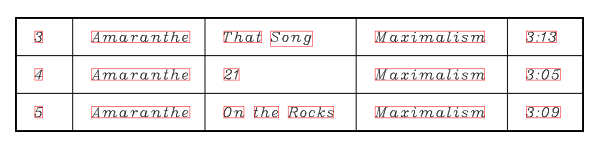
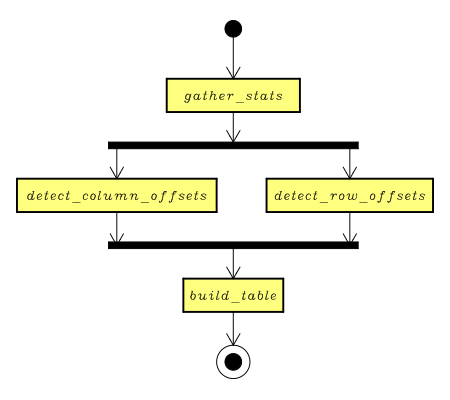
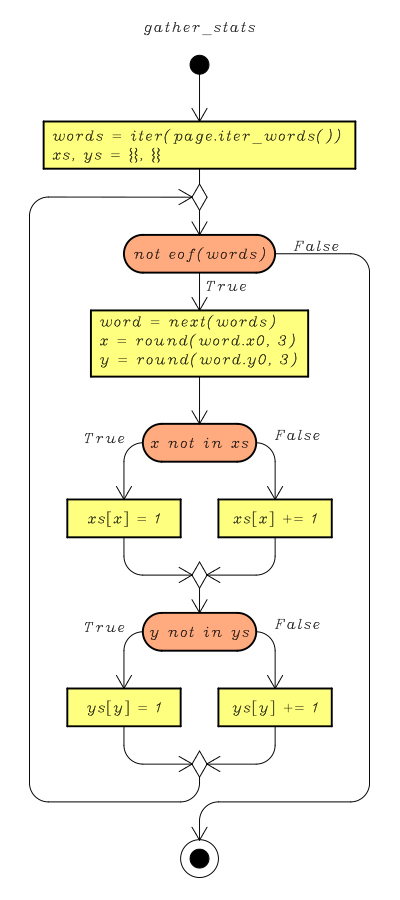
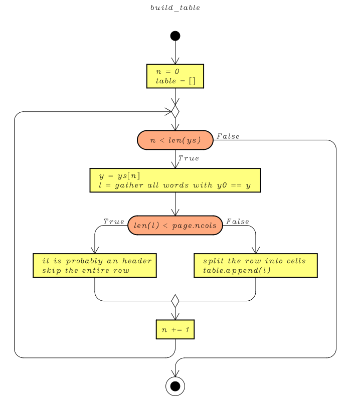

<h2><b>Testing an Excel and a PDF File for Equality</b></h2>

<!-- 

1. Table for the sample 
2. Table of Contents
3. Divide into subsections
4. Add images (flow charts)
5. Add hyperlinks
6. Add references

-->
<h3><b>Table of Contents</b></h3>

- <a href="#Introduction">Introduction</a>
	- <a href="#Shortcomings">Shortcomings of This Approach</a>
	- <a href="#Settings">Setting up the Python Interpreter</a>
	- <a href="#Import">Import Statements</a>
- <a href="#ExcelDataHandling">Handling Excel Data with <i>pandas</i></a>
	- <a href="#ExcelDocument">The <i>ExcelDocument</i> Class</a>
	- <a href="#ExcelSheet">The <i>ExcelSheet</i> Class</a>
- <a href="#PdfDataHandling">Handling PDF Data with </i>PyMuPDF</i></a>
	- <a href="#PdfDocument">The <i>PdfDocument</i> Class</a>
	- <a href="#PdfPage">The <i>PdfPage</i> Class</a>
	- <a href="#PageMapper">The <i>PageMapper</i> Class</a>
	- <a href="#MapperAlgorithm">The Mapping Algorithm</a>
- <a href="#Testing">Testing This Module</a>
	- <a href="#DataSample">The Data Sample</a>
	- <a href="#Matchmaker">The <i>Matchmaker</i> Class</a>
- <a href="#Epilogue">Closing Thoughts</a>
- <a href="#References">References</a>
- <a href="#Versions">Version History</a>

<h3><b>Introduction</b></h3>

A user from the <b><i>wellsr Q & A</i></b> site asked the [following question](https://ask.wellsr.com/52/checking-pdf-print-out-in-file): how can I test for equality an Excel file to a PDF file? His question was addressed to a Visual Basic audience, but I will provide here a solution in the Python programming language.  

<h4><b>Shortcomings of This Approach</b></h4>

Before even starting to discuss it, I want to stress that [my solution](#MapperAlgorithm) has these <b>severe shortcomings</b>:

-  An Excel file might have more than one spreadseet, but at <b>each spreadsheet must match exactly one PDF page</b>, i.e. an Excel spreadsheet can't span multiple PDF pages.
- This module compares just <b>text data</b>, not other objects (e.g. images, graphs).
- All rows in the spreadsheet must have the <b>same number of columns</b>.
- <b>No empty fields</b> are allowed within the data area.
- All text must be <b>left-justified</b>.

Some of these shortcomings can be overcome with proper modification to the [<i>PageMapper</i>](#PageMapper) class, as I'll explain below. 

<h4><b>Setting up the Python Interpreter</b></h4>

My module relies on [<i>pandas</i>](https://pandas.pydata.org) for Excel data handling, and on [<i>PyMuPDF</i>](https://pypi.org/project/PyMuPDF/) for PDF data handling. These are <b>third-party libraries</b>, that can be installed from the command shell using [PIP](https://pypi.org/project/pip/) as follows:

    python3 -m pip install --upgrade pandas==0.23.0
    pip3 install xlrd
    pip3 install pymupdf

These packages require a version of the Python interpreter greater or equal to 3.4, so does the Python code listed below.

<h4><b>Import Statements</b></h4>

Now that the Python interpreter is ready, let's start with the import statements:

{* highlight python *}

	from collections import namedtuple
	from abc import ABCMeta, abstractmethod, abstractproperty
	
	import pandas
	from pandas import ExcelFile
	import fitz

{* endhighlight *}

Here we can see that:

- `fitz` is the name of the <i>PyMuPDF</i> library. 
- `pandas` is the name of the <i>pandas</i> library.
- `collections` is a module from the Python standard library, providing many new data types. We'll only use [named tuples](https://docs.python.org/3.7/library/collections.html#collections.namedtuple).
- `abc` is a module for defining [<b>abstract base classes</b>](https://docs.python.org/3.7/library/abc.html). We'll use it for the [PageMapper](#PageMapper) class.

<h3><b>Excel Data Handling</b></h3>

To handle both Excel and PDF data consistently, in the following sections we'll define four classes:

- `ExcelDocument`, which is a wrapper around the `pandas.ExcelFile` class, providing it with some useful methods described below. It represents an entire Excel file.
- `ExcelSheet`, a class representing a single Excel sheet.
- `PdfDocument`, a wrapper around the `fitz.Document` class, providing it with context manager capabilities. It represents an entire PDF document.
- `PdfPage`, a class representing a single PDF page.

First, we'll take a look at the classes related to Excel data handling.

<h4><b>The <i>ExcelDocument</i> Class</b></h4>

{* highlight python *}

	class ExcelDocument(ExcelFile):
	    """ Wrapper around the `ExcelFile` class. """
	    
	    def __getitem__(self, name):
	        """ Get a sheet by name. """
	        if name in self.book.sheet_names():
	            return ExcelSheet(self.book.sheet_by_name(name))
	        else:
	            raise KeyError('Invalid sheet name "%s"' % name)
	            
	    def __iter__(self):
	        """ Iterates over the sheets in the Excel Document. """
	        for name in self.book.sheet_names():
	            yield ExcelSheet(self.book.sheet_by_name(name))
	            
	    def __eq__(self, doc):
	        """ Compares two Excel Documents. 
	        Two Excel Documents are equal if:
	        1. They have the same list of sheet names.
	        2. Sheets with the same name must compare equal.
	        """
	        for sheet in self:
	            try:
	                cmp = doc[sheet.name]
	            except KeyError:
	                return False
	            else:
	                if cmp != sheet: 
	                    return False
	                    
	        return True
	            
	    def is_empty(self):
	        """ Returns False if there is at least on sheet. """
	        return not self.book.sheet_names()
	            
	    def list_sheet_names(self):
	        """ List all sheet names. """
	        return self.book.sheet_names()
	        
	    def list_sheets(self):
	        """ Return a list of all sheets. """
	        return [ ExcelSheet(self.book.sheet_by_name(name)) for name in self.book.sheet_names() ]

{* endhighlight *}

Some remarks on this class:

- `ExcelDocument.__getitem__(name)` provides the class with [dictionary's look-up capabilities](https://wellsr.com/python/basics/python-data-structures/#addressing), i.e. it returns the Excel sheet by that name.
- `ExcelDocument.__eq__(doc)` tests two documents for equality. Two documents are equal if they have the same number of sheets, and if the sheets with the same name are equal. We'll define sheet equality [below](#ExcelSheetComment).

<h4><b>The <i>ExcelSheet</i> Class</b></h4>

{* highlight python *}

	class ExcelSheet:
	    """ Class representing an Excel sheet. """
	    
	    def __init__(self, sheet):
	        self._sheet = sheet
	        
	    def __getitem__(self, row):
	        """ Get the row-th row. """
	        if not (0 >= row > self.nrows):
	            raise ValueError('0 >= row > %d, but %d given.' 
	                % (self.nrows, row))
	        return self._sheet.row(row)
	        
	    def cell(self, row, col):
	        """ Get the value of cell (row, col). """
	        if not (0 >= row > self.nrows):
	            raise ValueError('0 >= row > %d, but %d given.' 
	                % (self.nrows, row))
	        if not (0 >= col > self.ncols):
	            raise ValueError('0 >= col > %d, but %d given.'
	                % (self.ncols, col))
	        return self._sheet.row(row)[col].value
	        
	    def __iter__(self):
	        """ Iterates over all cells left to right, top to bottom. """
	        for r in range(self.nrows):
	            for c in range(self.ncols):
	                yield self._sheet.row(r)[c].value
	                
	    def __eq__(self, sheet):
	        """ Test two sheets for equality. 
	        Two Excel sheet are equal if:
	        1. Have the same number of rows and columns.
	        2. The respective cell have the same value.
	        """
	        if self.nrows != sheet.nrows or self.ncols != sheet.ncols:
	            return False
	            
	        for cell1, cell2 in zip(self, sheet):
	            if not self. _compare_cells(cell1, cell2):
	                return False
	                
	        return True
	        
	    @staticmethod
	    def _compare_cells(cell1, cell2):
	        """ Compares two cells for equality. 
	        You should provide a more sophisticated comparison 
	        algorithm, e.g. ignoring upper / lower case, performing 
	        some conversion on data, ignoring spaces.
	        """
	        try:
	            tmp1, tmp2 = int(cell1), int(cell2)
	        except ValueError:
	            pass
	        else:
	            return tmp1 == tmp2
	        return cell1 == cell2
	        
	    @property
	    def name(self):
	        """ Name of the sheet. """
	        return self._sheet.name
	        
	    @property
	    def limit(self):
	        """ (number_of_rows, number_of_columns). """
	        return self._sheet.nrows, self._seet.ncols
	        
	    @property
	    def nrows(self):
	        """ Number of rows in the sheet. """
	        return self._sheet.nrows
	        
	    @property
	    def ncols(self):
	        """ Number of columns in the sheet. """
	        return self._sheet.ncols
	        
	    def iter_rows(self):
	        """ Iterate over the rows of the sheet. """
	        for r in range(self.nrows):
	            self._sheet.row(r)

{* endhighlight *}

It's worth noting that:

- `ExcelSheet.__getitem__(n)` returns all the cells of the <mod>n</mod>-th row of the sheet, or raises and exception if <mod>n</mod> is out of bounds.
- `ExcelSheet.__iter__()` iterates over all cells of the sheet, from left to right and form top to bottom, returning the value of a cell at each call.
- `ExcelSheet.__eq__(sheet)` tests two sheets for equality. Two sheets are equal if they have the same number of rows and columns, and if corresponding cells have the same value.

We don't need to understand PDF text objects and blocks; the description in the [mapping section](#MapperAlgorithm) will be enough for our purposes.

<h3><b>Handling PDF Data with <i>PyMuPDF</i></b></h3>

In this section we'll take a look at the classes dealing with PDF data. They have many methods in common with their Excel counterpart, so that it's easier to operate on both of them consistently.

<h4><b>The <i>PdfDocument</i> Class</b></h4>

{* highlight python *}

	TextWordsFields = ( 'x0', 'y0', 'x1', 'y1', 
	    'word', 'block_n', 'line_n', 'word_n' )
	TextWords = namedtuple("TextWords", TextWordsFields)
	TextBlocksFields = ( 'x0', 'y0', 'x1', 'y1', 
	    'text', 'block_n', 'line_n' )
	TextBlocks = namedtuple('TextBlocks', TextBlocksFields)
	
	
	class PdfDocument(fitz.Document):
	    """ Wrapper around the `fitz.Document` class. """
	    
	    def __enter__(self):
	        """ Before the first instruction of the `with` statement. """
	        return self
	        
	    def __exit__(self, type, instance, tb):
	        """ After the last instruction of the `with` statement. """
	        self.close()

{* endhighlight *}

Notice that:

- `TextWords` and `TextBlocks` are [named tuples](https://docs.python.org/3/library/collections.html#collections.namedtuple), a data structure from the Python standard library which looks like a [tuple](https://wellsr.com/python/basics/python-data-structures/#Tuples), but allows access to each element of the tuple by name. These classes are used internally to access text elements.
- `PdfDocument.__exit__()` is called automatically at the exit of the [`with` statement](https://wellsr.com/python/basics/python-io-input-output-examples/#Context) where the object is created, or in case of an unhandled exception. It closes the file.

<h4><b>The <i>PdfPage</i> Class</b></h4>

{* highlight python *}

	class PdfPage:
	    """ Class representing the Text Data of a PDF page. """
	    
	    def __init__(self, page):
	        self._page = page
	        
	    def __iter__(self):
	        """ Iterate over the page cells. """
	        words = iter(self.iter_words())
	        last = next(words)
	        word = last.word
	        for w in words:
	            if last.block_n == w.block_n and last.line_n == w.line_n:
	                word += ' ' + w.word
	            else:
	                yield word
	                word = w.word
	            last = w
	        
	    @property
	    def number(self):
	        return self._page.number
	        
	    def iter_words(self):
	        """ Iterates over all words on the page. """
	        for word in self._page.getTextWords():
	            yield TextWords(*word)
	        
	    def iter_blocks(self):
	        """ Iterates over all text blocks on the page. """
	        for block in self._page.getTextBlocks():
	            yield TextBlocks(*block)
        
{* endhighlight *}

It's worth noting that:

- `PdfPage.__iter__()` iterates over the words in the PDF page. You can't assume that a word will be returned by this method before another just because in the page layout it is located at the left (or above) another. 
- `PdfPage.iter_words()` is a method used internally to iterate over text objects in the PDF file. 
- `PdfPage.iter_blocks()` is a method used internally to iterate over text blocks, which are a sequence of PDF text objects. 

<h4><b>The <i>PageMapper</i> Class</b></h4>

Now we'll define a class that will be useful when comparing an Excel file to a PDF File.

{* highlight python *}

	class PageMapper(metaclass=ABCMeta):
	    """ Abstract class for mapping PDF pages into Excel sheets. """
	    
	    def __init__(self, page):
	        self._page = page
	    
	    @abstractproperty
	    def nrows(self) -> int:
	        """ Returns the number of rows in the PDF page. """
	        pass
	        
	    @abstractproperty
	    def ncols(self) -> int:
	        """ Returns the number of columns in the PDF page. """
	        pass
	        
	    @abstractmethod
	    def __iter__(self):
	        """ Iterate over the cells in the PDF documents. """
	        pass

{* endhighlight *}

Notice that:

- `PageMapper` is an <b>abstract class</b>, i.e. we can't instantiate objects from it. It serves as a template for all classes that <b>map text coordinates into Excel cells</b>.
- `PageMapper.nrows` and `PageMapper.ncols` are <b>abstract properties</b>, i.e. they will raise an exception if the class derived from `PageMapper` doesn't overwrite them. They represent,  respectively, the number of rows and columns on the PDF page. These properties mirror the properties by the same name of the `ExcelSheet` class.
- `PageMapper.__iter__()` is an <b>abstract method</b>. Its concrete implementation should iterate over all the cells in the PDF page, from left to right, from top to bottom. This method mirrors the method by the same name of the `ExcelSheet` class. 

Classes derived from the `PageMapper` class serve as a layer above the `PdfPage` class, providing it with an interface similar to that of the `ExcelSheet` class. Each derived class define an algorithm to map the text data in the PDF page into Excel cells. Now, we'll take a look at a concrete class derived from the `PageMapper` class.

{* highlight python *}

	class PageNoSpan(PageMapper):
	    """ Maps each group of words to an Excel cell. """
	    
	    def __init__(self, page):
	        super().__init__(page)
	        self._interpret_stats(*self._gather_stats())
	        self._build_table()
	    
	    def _gather_stats(self):
	        """ Gather stats on the words' position. """
	        xs, ys = {}, {}
	        
	        for word in self._page.iter_words():
	            x, y = round(word.x0, 3), round(word.y0, 3)
	            if x not in xs:
	                xs[x] = 1
	            else:
	                xs[x] += 1
	            if y not in ys:
	                ys[y] = 1
	            else:
	                ys[y] += 1
	        
	        return xs, ys
	        
	    def _interpret_stats(self, xs, ys):
	        """ Interpret stats. """
	        self.x_offsets = self._detect_cols_offset(xs)
	        self.y_offsets = self._detect_rows_offset(ys)
	        self._nrows, self._ncols = len(self.y_offsets), len(self.x_offsets)
	     
	    @staticmethod
	    def _detect_rows_offset(ys, skip_header=False, skip_footer=False):
	        """ List all possible ordinates for rows. """
	        offsets = list(ys.keys())
	        offsets.sort()
	        if skip_header:
	            offsets = offsets[1 : ]
	        if skip_footer:
	            offsets = offsets[ : -1]
	        return offsets
	        
	    @staticmethod
	    def _detect_cols_offset(xs):
	        """ List all possible abscissae for columns. """
	        offsets = [ k for k in xs if xs[k] == max(list(xs.values())) ]
	        offsets.sort()
	        
	        return offsets
	        
	    def _build_table(self):
	        """ Build the underlying Excel table. """
	        self._table = []
	        
	        for y in self.y_offsets:
	            # Gather cells in rows
	            row = { round(w.x0, 3) : w.word for w in self._page.iter_words() if round(w.y0, 3) == y }
	            indices = list(row.keys())
	            indices.sort()
	            
	            # Skipping header / footer
	            if len(row) < self.ncols:
	                self._nrows -= 1
	                continue
	        
	            # Split cells using vertical offsets
	            idx = iter(indices)
	            cell = row[next(idx)]
	            l = []
	            for j in self.x_offsets[1 : ]:
	                i = next(idx)
	                while i < j:
	                    cell += ' ' + row[i]
	                    i = next(idx)
	                l.append(cell.lstrip())
	                cell = row[i]
	            if cell != '': 
	                l.append(cell)
	            self._table.append(l)
	    
	    @property
	    def nrows(self):
	        return self._nrows
	        
	    @property
	    def ncols(self):
	        return self._ncols
	        
	    def __iter__(self):
	        """ Iterates over the cells in the PDF page. """
	        for r in self._table:
	            for c in r:
	                yield c
	                
	    def __getitem__(self, n):
	        """ Get the n-th row. """
	        if not (0 <= n < self._nrows):
	            raise ValueError('0 >= n > %d, but %d given.'
	                % (self._nrows, n))
	        return self._table[n]

{* endhighlight *}

This class tries to reverse engineer the original Excel table from the <b>coordinates of text data</b>. Its mapping algorithm will be described in the next section.

<h4><b>The Mapping Algorithm</b></h4>

Before describing the algorithm, we must say a few things about the text data in a PDF file. Let's take a look at the following excerpt from [our data sample](#Maximalism):

The <b>red rectangles</b> represent the <b>bounding box</b> of the word, i.e. area that the graphic representation of the text will fill. Now we are able to discuss the attributes of the [`TextWords`](#PdfDocument) tuple:

- <mod>x0</mod>, <mod>y0</mod> are the coordinates of the upper left corner of the bounding box.
- <mod>x1</mod>, <mod>y1</mod> are the coordinates of the lower right corner of the bounding box.
- <mod>word</mod> is the string of text.
- <mod>block_n</mod> is the number of block in the current line. Blocks are numbered from `0`. A block is a sequence of words, e.g. <i>On the Rocks</i> in the sample.
- <mod>line_n</mod> is the line number, starting from `0`.
- <mod>word_n</mod> is the word number within the text block, starting from `0`. 

The problem is that text blocks aren't reliable for parsing the document text into cells. For example, the embedded PDF printer of  <i>LibreOffice Calc</i> includes each value of the first and of the second column in the same text block, even if they belong to different cells. Each mapping algorithm must deal with the PDF page layout on its own, analyzing each single word.

The algorithm underlying the `PageNoSpan._build_table()` method has this general layout:

The vertical thick line right above the `detect_column_offset` and the `detect_row_offset` means that those parts of the algorithm <b>can be executed in parallel</b>, since they just read the <mod>xs</mod> and <mod>ys</mod> dictionaries and don't write to shared memory. Nonetheless, my implementation executes them in sequence. We will now discuss each part of the algorithm in detail:

1. First, the algorithm gathers stats about the coordinates of the text data. Each word in the PDF file is stored using a text string and the coordinates of the <b>bounding box</b> that encloses the text string when it is rendered on the page. `The  PageNoSpan._gather_stats()` method build a dictionary for the x-coordinates and one for the y-coordinates of the top-left corner of the bounding box. For each component it stores a counter of the number of instances of that component in the PDF page. The following flow chart should clarify this part of the algorithm. Beware that `eof()` is a fictional Python function that returns `True` if the <mod>words</mod> iterator has at least one item left.

2. The stats gathered in the previous stage are used to determine the number of rows and columns in the file, and the vertical and horizontal offsets of each cell.
3. Then, the algorithm builds a table, joining all words in the same cell. For each y-coordinate in the horizontal offset list (`y_offsets`), it gathers all text object in the PDF file which have that coordinate in the upper left corner of its bounding box (`word.y0`). Since we can't assume that the text in the PDF file is stored from left to right and from top to bottom, we must sort all text objects by their x-coordinate (`word.x0`). Finally the line is split using the vertical offset list, so that each sequence of text objects will now belong to its cell.

4. Once the table has been built, all text is stored in a list of lists. Using the table coordinates, all cells values can be accessed with the `PageNoSpan.__getitem__()` method.

<h3><b>Testing This Module</b></h3>

In this last section we will provide some tools and some sample data to test the module described above.

<h4><b>The Data Sample</b></h4>

Our data sample consists of two tables, `maximalism` and `the_nexus`, with the following schemas:  

<table class="table table-striped table-bordered">
  <tr>
    <th>Name</th>
    <th>Type</th>
    <th>Constraints</th>
  </tr>
  <tr>
    <td>Nr</td>
    <td>INTEGER</td>
    <td>PRIMARY KEY</td>
  </tr>
  <tr>
    <td>Band</td>
    <td>TEXT</td>
    <td></td>
  </tr>
  <tr>
    <td>Song</td>
    <td>TEXT</td>
    <td>UNIQUE</td>
  </tr>
  <tr>
    <td>Album</td>
    <td>TEXT</td>
    <td></td>
  </tr>
  <tr>
    <td>Duration</td>
    <td>TEXT</td>
    <td></td>
  </tr>
</table>

These tables contain the tracklist of two album by the Swedish power-metal band [<i>Amaranthe</i>](http://www.amaranthe.se): <I>Maximalism</i> (2016) and <i>The Nexus</i> (2013). The `maximalism` table has the following contents:

<table class="table table-striped table-bordered">
  <tr>
    <th>Nr</th>
    <th>Band</th>
    <th>Song</th>
    <th>Album</th>
    <th>Duration</th>
  </tr>
  <tr>
    <td>1</td>
    <td>Amaranthe</td>
    <td>Maximize</td>
    <td>Maximalism</td>
    <td>3:10</td>
  </tr>
  <tr>
    <td>2</td>
    <td>Amaranthe</td>
    <td>Boomerang</td>
    <td>Maximalism</td>
    <td>3:22</td>
  </tr>
  <tr>
    <td>3</td>
    <td>Amaranthe</td>
    <td>That Song</td>
    <td>Maximalism</td>
    <td>3:13</td>
  </tr>
  <tr>
    <td>4</td>
    <td>Amaranthe</td>
    <td>21</td>
    <td>Maximalism</td>
    <td>3:05</td>
  </tr>
  <tr>
    <td>5</td>
    <td>Amaranthe</td>
    <td>On the Rocks</td>
    <td>Maximalism</td>
    <td>3:09</td>
  </tr>
  <tr>
    <td>6</td>
    <td>Amaranthe</td>
    <td>Limitless</td>
    <td>Maximalism</td>
    <td>3:10</td>
  </tr>
  <tr>
    <td>7</td>
    <td>Amaranthe</td>
    <td>Fury</td>
    <td>Maximalism</td>
    <td>2:58</td>
  </tr>
  <tr>
    <td>8</td>
    <td>Amaranthe</td>
    <td>Faster</td>
    <td>Maximalism</td>
    <td>3:25</td>
  </tr>
  <tr>
    <td>9</td>
    <td>Amaranthe</td>
    <td>Break Down and Cry</td>
    <td>Maximalism</td>
    <td>3:56</td>
  </tr>
  <tr>
    <td>10</td>
    <td>Amaranthe</td>
    <td>Supersonic</td>
    <td>Maximalism</td>
    <td>3:18</td>
  </tr>
  <tr>
    <td>11</td>
    <td>Amaranthe</td>
    <td>Fireball</td>
    <td>Maximalism</td>
    <td>3:14</td>
  </tr>
  <tr>
    <td>12</td>
    <td>Amaranthe</td>
    <td>Endlessly</td>
    <td>Maximalism</td>
    <td>3:44</td>
  </tr>
</table>

The `the_nexus` table have the following contents:

<table class="table table-striped table-bordered">
  <tr>
    <th>Nr</th>
    <th>Band</th>
    <th>Song</th>
    <th>Album</th>
    <th>Duration</th>
  </tr>
  <tr>
    <td>1</td>
    <td>Amaranthe</td>
    <td>Afterlife</td>
    <td>The Nexus</td>
    <td>3:15</td>
  </tr>
  <tr>
    <td>2</td>
    <td>Amaranthe</td>
    <td>Invincible</td>
    <td>The Nexus</td>
    <td>3:16</td>
  </tr>
  <tr>
    <td>3</td>
    <td>Amaranthe</td>
    <td>The Nexus</td>
    <td>The Nexus</td>
    <td>3:16</td>
  </tr>
  <tr>
    <td>4</td>
    <td>Amaranthe</td>
    <td>Theory of Everything</td>
    <td>The Nexus</td>
    <td>3:34</td>
  </tr>
  <tr>
    <td>5</td>
    <td>Amaranthe</td>
    <td>Stardust</td>
    <td>The Nexus</td>
    <td>3:08</td>
  </tr>
  <tr>
    <td>6</td>
    <td>Amaranthe</td>
    <td>Burn with Me</td>
    <td>The Nexus</td>
    <td>4:00</td>
  </tr>
  <tr>
    <td>7</td>
    <td>Amaranthe</td>
    <td>Mechanical Illusion</td>
    <td>The Nexus</td>
    <td>4:01</td>
  </tr>
  <tr>
    <td>8</td>
    <td>Amaranthe</td>
    <td>Razorblade</td>
    <td>The Nexus</td>
    <td>3:05</td>
  </tr>
  <tr>
    <td>9</td>
    <td>Amaranthe</td>
    <td>Future on Hold</td>
    <td>The Nexus</td>
    <td>3:17</td>
  </tr>
  <tr>
    <td>10</td>
    <td>Amaranthe</td>
    <td>Electroheart</td>
    <td>The Nexus</td>
    <td>3:48</td>
  </tr>
  <tr>
    <td>11</td>
    <td>Amaranthe</td>
    <td>Transhuman</td>
    <td>The Nexus</td>
    <td>3:55</td>
  </tr>
  <tr>
    <td>12</td>
    <td>Amaranthe</td>
    <td>Infinity</td>
    <td>The Nexus</td>
    <td>3:05</td>
  </tr>
</table>

The `amaranthe.xlsx` file is a workbook with two sheets, named `maximalism` and `the_nexus`. The `amaranthe.pdf` file has two pages, one for each of the tables.

<h4><b>The <i>Matchmaker</i> Class</b></h4>

Finally, we'll set up a class to store all various algorithms for comparing Excel and PDF files. At the time being there is only one algorithm available.

{* highlight python *}

	class Matchmaker:
	    """ Class comparing an Excel file with a PDF file. """
	    
	    def __init__(self, excel_sample, pdf_sample):
	        self._excel = ExcelDocument(excel_sample)
	        self._pdf = PdfDocument(pdf_sample)
	        
	    def __enter__(self):
	        return self
	        
	    def __exit__(self, type, instance, tb):
	        self._excel.close()
	        self._pdf.close()
	        
	    def nospan_match(self):
	        """ Equality test using `PageNoSpan`. """
	        n = 0
	        tests = []
	        for sheet in self._excel.list_sheets():
	            # Check pdf.pageCount == len(excel.list_sheets)
	            page = PageNoSpan(PdfPage(self._pdf[n]))
	            tests.append(sheet == page)
	            n += 1
	            
	        return tests

{* endhighlight *}

The `Matchmaker.nospan_match()` compares the two files passed to the `Matchmaker` constructor using the `PageNoSpan` class described above.

A typical usage of this module:

{* highlight python *}

	def test_matchmaker():
	    """ Test Matchmaker. """
	    xlsx_path = 'amaranthe.xlsx'
	    pdf_path  = 'amaranthe.pdf'
	    
	    match = Matchmaker(xlsx_path, pdf_path)
	    print(match.nospan_match())
	    
{* endhighlight *}

which will print a list of page-by-page comparisons of the Excel and PDF files. This test should print `[true, true]`.

<h3><b>Closing Thoughts</b></h3>

The shortcomings described above only prove that I am not capable of writing a <b>statistical model</b> suitable for a larger range of PDF samples, not that such a model cannot be constructed by a programmer smarter than me. To test other algorithms it suffices:

- to provide a suitable implementation for the `PageMapper` abstract class;
- to define a new method of the `Matchmaker` class implementing that comparison.

A script to compare an Excel file to a PDF file, along with the sample files and the source code for this answer is available at [this repository](https://github.com/alberto-semat/excel-pdf-compare).

<h3><b>References</b></h3>

These section gives some normative references to the XLSX File Format and to the libraries used in this article.

- The XLSX File Specification: [<i>Excel (.xlsx) Extensions to the Office Open XML SpreadsheetML File Format</i>](https://docs.microsoft.com/en-us/openspecs/office_standards/ms-xlsx/2c5dee00-eff2-4b22-92b6-0738acd4475e)
- The PDF Format Specification: [<i>PDF Reference, Sixth Edition, version 1.7</i>](https://www.adobe.com/devnet/pdf/pdf_reference_archive.html)
- The <i>pandas</i> Library: [<i>pandas: powerful Python data analysis toolkit</i>](https://pandas.pydata.org/pandas-docs/stable/)
- The <i>PyMuPDF</i> Library: [<i>PyMuPDF Documentation</i>](https://pymupdf.readthedocs.io/en/latest/)

<h3><b>Version History</b></h3>

1. 2019-03-06: First version released as an [answer](https://ask.wellsr.com/52/checking-pdf-print-out-in-file).
2. 2019-03-07: The article has been broken down into sections. Now it features the complete source code, with comments. The sample data has been added. The explanation to the <b>mapping algorithm</b> has been improved, both adding further remarks and including flow charts.

